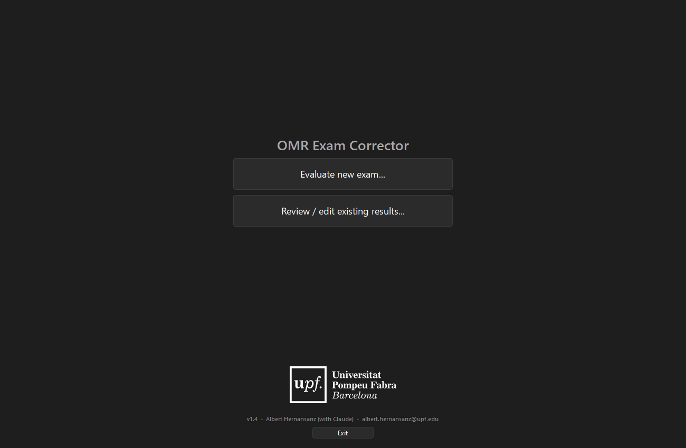
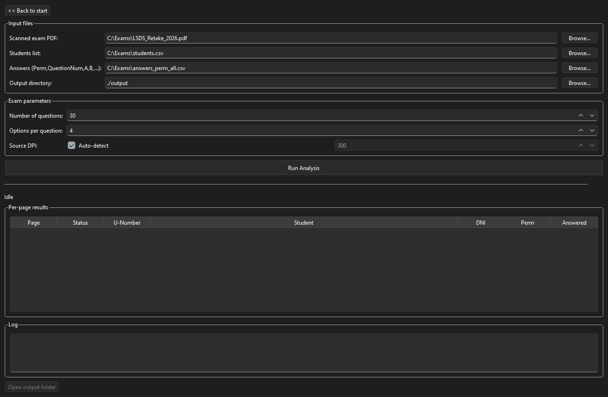
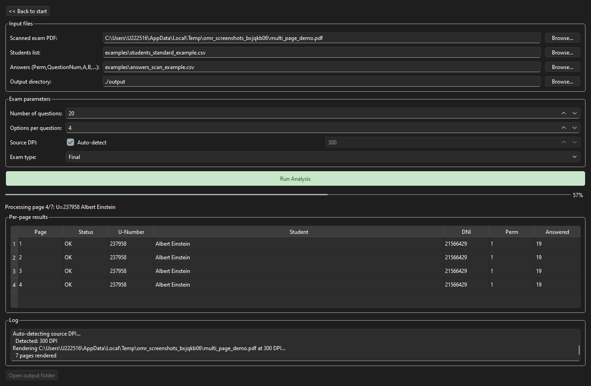
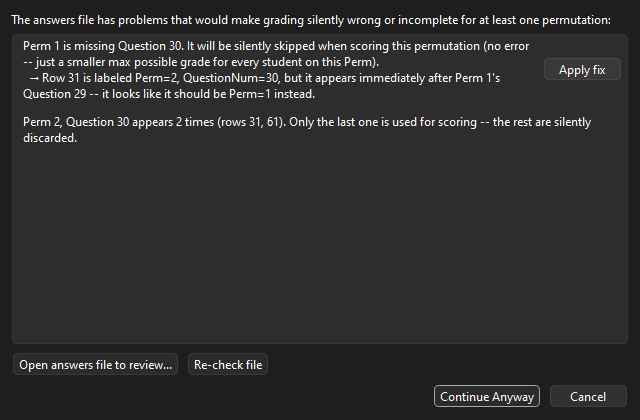
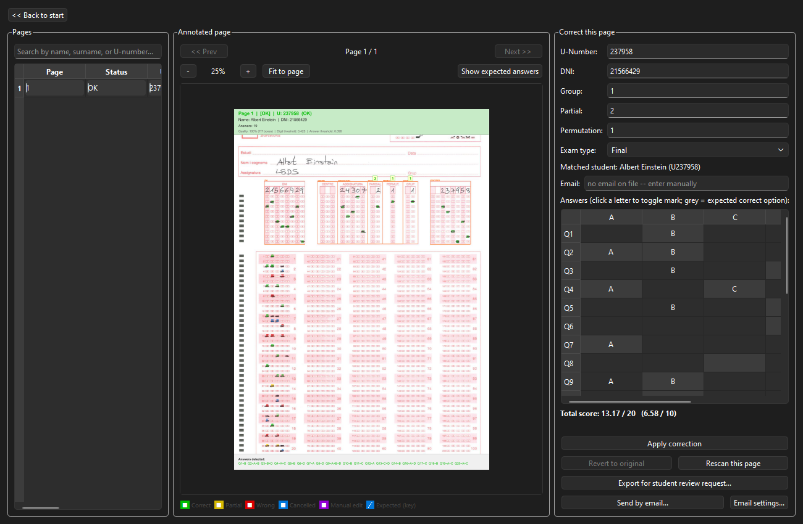
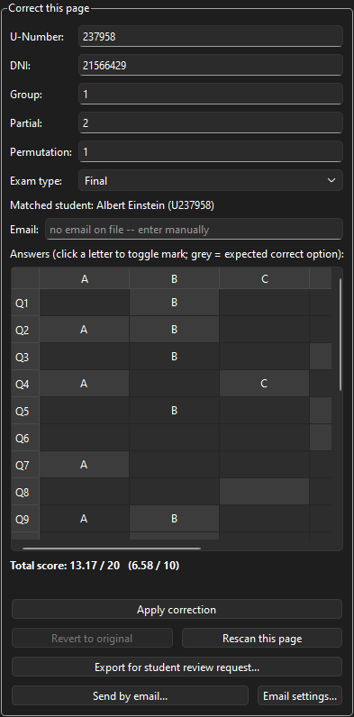
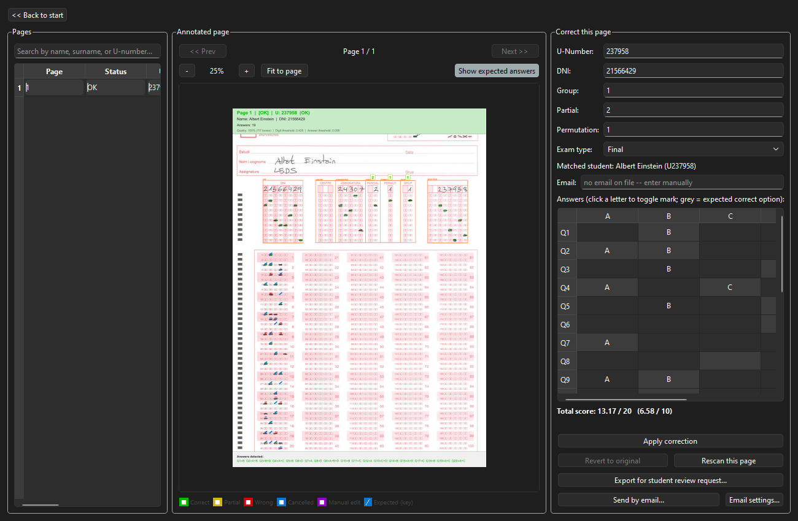
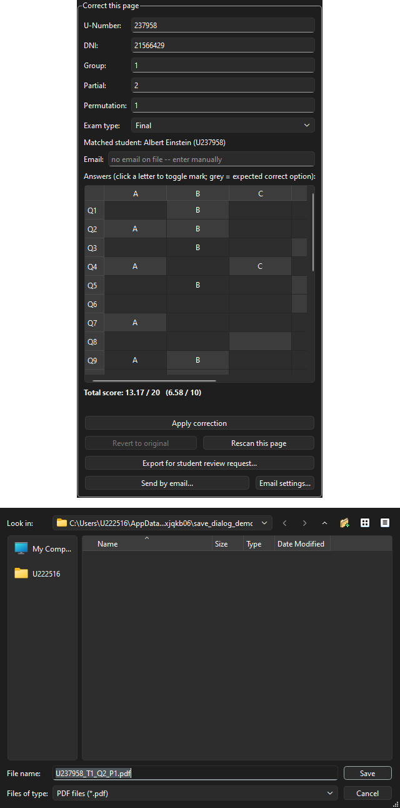
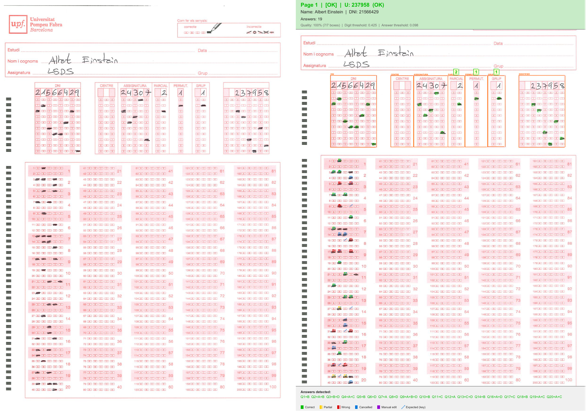

# OMR Exam Corrector — User Manual

**Version 1.4** · Albert Hernansanz ([albert.hernansanz@upf.edu](mailto:albert.hernansanz@upf.edu))

---

## Table of contents

1. [Overview](#1-overview)
2. [Before you start — input files](#2-before-you-start--input-files)
3. [Start screen](#3-start-screen)
4. [Evaluating a new exam](#4-evaluating-a-new-exam)
5. [Answer-key validation (v1.4)](#5-answer-key-validation-v14)
6. [Review screen — navigating results](#6-review-screen--navigating-results)
7. [Review screen — correcting a page](#7-review-screen--correcting-a-page)
8. [Expected-answers overlay (v1.2)](#8-expected-answers-overlay-v12)
9. [Exporting a page for a student review request (v1.3)](#9-exporting-a-page-for-a-student-review-request-v13)
10. [Emailing a student their review PDF](#10-emailing-a-student-their-review-pdf)
11. [Output files](#11-output-files)
12. [Reopening a previous session](#12-reopening-a-previous-session)
13. [Colour conventions in the annotated PDF](#13-colour-conventions-in-the-annotated-pdf)
14. [Keyboard shortcuts and navigation tips](#14-keyboard-shortcuts-and-navigation-tips)
15. [Troubleshooting](#15-troubleshooting)

---

## 1. Overview

The OMR Exam Corrector reads a scanned PDF of UPF bubble-sheet exams,
identifies each student by the U-number bubbles on their sheet, grades their
answers against an answer key, and produces:

- **`results.xlsx`** — one spreadsheet sheet per exam permutation with all grades.
- **`annotated_review.pdf`** — the scan with colour-coded annotations for visual review.
- **`review_cache.pkl`** — a session file that lets you reopen and continue
  editing without re-running the OCR.

The desktop GUI walks you through the process in three screens:
**Start → New exam → Review**.

---

## 2. Before you start — input files

You need three files before running an analysis.

### 2.1 Scanned exam PDF

A single multi-page PDF where each page is one student's completed answer
sheet, scanned at **300 or 600 DPI**. The app auto-detects the DPI from the
PDF metadata; if that fails you can set it manually.

- Pages can be in any order — each page is matched to a student individually.
- Orientation is auto-corrected; portrait and landscape scans both work.
- Pages that cannot be processed (low quality, wrong template, heavily skewed)
  are flagged for manual review and do not block the rest.

### 2.2 Students list (CSV or Excel)

A spreadsheet with one row per student. Four formats are accepted — the app
detects which one you're using automatically from the column headers.

**Standard format** — columns `Nom`, `Cognom1`, `Cognom2`, `U_number`:

| Nom   | Cognom1 | Cognom2 | U_number |
|-------|---------|---------|----------|
| Alice | Example | Smith   | U000001  |
| Bob   | Sample  | Jones   | U000002  |
| Carol | Test    | Brown   | U000003  |

**UPF official export** — `.xls` or `;`-separated CSV with a course-code row
on row 1 and column headers `IDUSUARI;NIA;NIP;COGNOM1;COGNOM2;NOM` on row 2.

**Moodle "participants" export** (e.g. `courseid_NNNNN_participants.csv`) —
columns `Nom`, `Cognoms` (both surnames in one field, split on the first
space), `Número ID` (the U-number, typically lowercase `u123456`), and
`Grups` (e.g. `201-7`: theory group + seminar subgroup). The leading digit
of `Grups` becomes the student's theory group, used for the GRUP
cross-check described in [section 11](#11-output-files) below.

**UPF `llistatGGiA` export** — the same two-row layout as the official
export, with two extra columns: `EMAIL` (carried through into
`results.xlsx`, not used for grading — handy for emailing a student their
scanned exam) and `PRACTICA` (e.g. `102`; its leading digit is the theory
group, same as `Grups` above).

> **Theory group vs. seminar subgroup**: only the theory group (a single
> digit, 1 or 2) has a bubble field on the exam sheet (GRUP). The seminar
> subgroup encoded in `Grups`/`PRACTICA` has no corresponding field on the
> sheet and is not used.

### 2.3 Answer key (CSV or Excel)

One row per question per permutation. Required columns: `Perm`,
`QuestionNum`, and one column per answer option (`A`, `B`, `C`, `D`, …).
A value of `1` means that option is correct; `0` means incorrect. Multiple
correct options per question are supported (partial credit).

| Perm | QuestionNum | A | B | C | D |
|------|-------------|---|---|---|---|
| 0    | 1           | 0 | 1 | 0 | 0 |
| 0    | 2           | 1 | 1 | 0 | 0 |
| 1    | 1           | 0 | 0 | 1 | 0 |
| 1    | 2           | 0 | 1 | 0 | 1 |

Each scanned page declares its own permutation via the PERMUT bubble on the
form; the app grades it against the matching key automatically.

> **Before grading starts**, the file is checked for questions missing or
> duplicated within a permutation — see [section 5](#5-answer-key-validation-v14).

---

## 3. Start screen



When you launch the app you see two main buttons:

- **Evaluate new exam…** — opens the New exam screen to run a fresh analysis.
- **Review / edit existing results…** — opens a file picker to select a
  `review_cache.pkl` from a previous session and jump straight into the
  Review screen.

Click **Exit** (bottom) to close the application.

---

## 4. Evaluating a new exam

### 4.1 Fill in the input files



| Field | What to pick |
| ------- | ----------- |
| **Scanned exam PDF** | The multi-page PDF of scanned answer sheets. |
| **Students list** | CSV or Excel file with student names and U-numbers. |
| **Answers (Perm, QuestionNum, A, B, …)** | CSV or Excel answer key with permutations. |
| **Output directory** | Folder where results will be saved (default: `./output`). |

Use **Browse…** next to each field or type the path directly.

### 4.2 Set exam parameters

| Parameter | Description |
| ----------- | ----------- |
| **Number of questions** | How many questions to grade (1–100). Must match your answer key. |
| **Options per question** | Number of answer options per question (2–10, default 4). |
| **Source DPI** | Leave **Auto-detect** checked unless auto-detection fails. |

### 4.3 Run the analysis

Click **Run Analysis**. The progress bar advances as each page is processed,
and the table fills with live results: page number, status, detected
U-number, matched student name, DNI, permutation, and number of answered
questions.



When processing finishes:

- The **Open output folder** button becomes active.
- The app switches automatically to the Review screen.

### 4.4 Status codes

| Status | Meaning |
| -------- | --------- |
| `OK` | Page processed successfully. |
| `CORNER_ERROR` | Could not detect the form's outer border. |
| `MARKER_ERROR` | Found the border but could not locate the alignment markers. |
| `EXCEPTION` | Unexpected error — see the Log panel for details. |

---

## 5. Answer-key validation (v1.4)

Before the analysis starts, the answers file is checked for the kind of
data-entry mistake that used to grade silently wrong:

- A `Perm`/`QuestionNum` row missing for one permutation, or duplicated
  across rows. A missing question is otherwise simply excluded from that
  permutation's max possible grade, and a duplicate just lets the last
  matching row win — every student on that permutation would be graded
  against an incomplete or wrong key with nothing pointing at why.
- A blank `Perm` cell on some row.
- **Fewer option columns than "Options per question" expects** — e.g. a
  4-option (A–D) answer key used for a 6-option exam. This is easy to hit
  (a reused or wrong-sized template) and otherwise completely silent: a
  student marking option E or F scores as if it were always wrong, since
  that option can never appear in any question's correct-answer set.

If any issue is found, a dialog lists them before the run starts:



- **Open answers file to review...** — opens the file in your system's
  default spreadsheet/text application.
- **Apply fix** (shown per-issue when a confident suggestion exists) — the
  most common cause is a `Perm` value copy/pasted one row too early (e.g.
  the file goes `...,1,29,... / 2,30,... / 2,1,...` where that `2,30` row
  was meant to be `1,30`); clicking **Apply fix** relabels just that one
  row in place. A backup of the original file is written alongside it
  (`<filename>.bak`) before any change.
- **Re-check file** — re-reads the file from disk, for after you've edited
  it yourself in the other application.
- **Continue Anyway** — proceeds with the run despite the issue(s); use
  this only if you understand exactly what's missing and accept the
  consequence for that permutation's grades.
- **Cancel** — aborts, so you can fix the file and re-run.

From the command line, the same check runs automatically and the tool
**refuses to proceed** if it finds a problem, printing the same messages and
suggested fixes; pass `--ignore-answer-key-warnings` to proceed anyway (see
[INSTALL.md](INSTALL.md) for the full CLI reference).

---

## 6. Review screen — navigating results



The review screen has three panels:

- **Left — Pages table**: one row per scanned page. Click any row to jump to
  that page.
- **Centre — Annotated page**: renders the annotated PDF for the selected
  page with the colour-coded overlays.
- **Right — Correct this page**: editable fields for identification data and
  an answer grid.

### 6.1 Preview controls

| Control | Action |
| --------- | -------- |
| **<< Prev / Next >>** | Navigate to the previous or next page. |
| **– / +** | Zoom out / in (each click multiplies by 1.25×). |
| **Fit to page** | Scale the preview to fit the visible area. |
| **Ctrl + scroll wheel** | Zoom in/out with the mouse wheel. |
| **Middle-click drag** | Pan the preview when zoomed in. |
| **Show expected answers** | Toggle the expected-answers overlay on/off. |

---

## 7. Review screen — correcting a page

### 7.1 Identification fields

The right panel shows the values the OCR read for the current page, in this
order (updated in v1.3 to read top-to-bottom the way a reviewer typically
checks them):

| Field | Description |
| ------- | ----------- |
| **U-Number** | Student identifier (digits only, without the leading "U"). The **Matched student** label updates live as you type. |
| **DNI** | National ID number as read from the DNI bubbles. |
| **Group** | Student group code (the sheet's GRUP bubbles). |
| **Partial** | Exam part number, if used (the sheet's PARCIAL bubbles). |
| **Permutation** | Exam permutation — determines which answer key is applied (the sheet's PERMUT bubbles). |

### 7.2 Answer grid

The grid shows one row per question and one column per answer option, plus a
trailing **Score** column (v1.4). Filled cells show the option letter (A,
B, C…); empty cells mean no mark. Click any cell (in an option column, not
the Score column) to toggle that mark on or off.

Every option the answer key marks correct is shaded **dark grey** — a
different signal from the preview panel's blue slash overlay
([section 8](#8-expected-answers-overlay-v12)), showing the same
information directly in the grid instead of on the scanned image.

A cell's text colour tells you where a mark came from:

| Colour | Meaning |
| -------- | --------- |
| Default (plain) | The scanner detected this mark — matches what OCR read from the sheet. |
| **Orange** | You just toggled this cell and haven't clicked **Apply correction** yet. |
| **Bold purple** | A mark you (or a previous reviewer) set by hand and that has been saved — it doesn't match what the scanner actually detected on the sheet. |

The purple state persists across sessions (it's recomputed from the saved
pixel data every time the page loads, the same way the purple "reviewer
added/removed" markers on the annotated PDF are), so a hand-corrected answer
never gets silently confused with an automatically detected one, even after
closing and reopening the review.

**Score column and total (v1.4)**: each row's Score cell shows that
question's partial-credit score (the same formula as
[INSTALL.md's scoring section](INSTALL.md#6-partial-credit-scoring-formula)),
and a **Total score** line below the grid sums them (`total / max  (grade
on a 0–10 scale)`). Both update immediately as you toggle a mark — before
clicking **Apply correction** — so you can see the effect of a correction
right away. A question the current permutation's answer key has no entry
for shows a blank Score cell and isn't shaded, and doesn't count toward the
total.

After editing, click **Apply correction** to save.

### 7.3 Saving corrections

- **Apply correction** — saves the current identification fields and answer
  marks. The button turns **orange** while the write is in progress.
- **Revert to original** — discards all manual changes and restores the
  original OCR reading. Requires confirmation; cannot be undone.
- **Rescan this page** — re-runs OCR on the original scanned PDF for this
  page only, discarding manual changes.



Every correction immediately updates `results.xlsx`, the relevant page of
`annotated_review.pdf`, and `review_cache.pkl`.

### 7.4 Manual-correction indicators

Changes made in the review screen appear highlighted in **purple** on the
annotated PDF:

- **Purple circle (O)** — an answer mark the reviewer *added*.
- **Purple cross (X)** — an answer mark the reviewer *removed*.
- **Purple pill badge** — an identification field edited by hand.

The same orange/purple colouring also appears directly in the answer grid
itself — see [7.2 Answer grid](#72-answer-grid) above.

The **Manual** column in the pages table shows **Y** for any page that has
at least one manual change.

---

## 8. Expected-answers overlay (v1.2)

The **"Show expected answers"** button in the preview toolbar draws a **blue
diagonal slash** through every bubble the answer key marks as correct for
the current page's permutation.



- **Off by default** — it is a reviewer aid, not part of the standard annotation.
- **Purely visual** — it never modifies the underlying scan or the annotated PDF.
- **Scales with zoom** and updates automatically when you navigate to a
  different page or apply a correction that changes the permutation.
- If the page's permutation is not detected or not found in the answer key,
  the overlay shows nothing silently.

**Typical use:** toggle the overlay on before checking a page to immediately
see which bubbles should be filled, without looking up the answer key
separately.

---

## 9. Exporting a page for a student review request (v1.3)

When a student formally requests a grade review, you often need to hand
over just *their* page rather than the whole batch PDF. The **"Export for
student review request..."** button (bottom of the "Correct this page"
panel) writes a self-contained, 2-page PDF for the page currently on
screen:



1. **Page 1** — the raw scanned page, exactly as filled in by the student,
   with no annotation layer at all.
2. **Page 2** — the same page fully annotated: the usual colour-coded
   overlays (see [section 13](#13-colour-conventions-in-the-annotated-pdf)),
   the expected-answers overlay (blue diagonal slash) drawn automatically
   for *every* bubble the answer key marks correct — even on questions the
   student left blank, not just the ones they attempted — and the colour
   legend from the preview panel, so the page is self-explanatory without
   the app open.



Clicking the button opens a save dialog pre-filled with a suggested
filename built from the page's identification fields:

```text
U<u_number>_T<group>_Q<partial>_P<permutation>.pdf
```

For example, U-number 225659, group 1, partial 2, permutation 2 becomes
**`U225659_T1_Q2_P2.pdf`**. Any field that couldn't be read is replaced with
`X` (e.g. `UX` if the U-number wasn't detected) so the filename always stays
well-formed — pick a different name in the dialog if that happens.

The button is disabled with an explanatory message for pages that failed
processing and have no scanned image to export.

---

## 10. Emailing a student their review PDF

If the students list has an **Email** column (currently only the
`llistatGGiA` roster format provides one — see
[section 2.2](#22-students-list-csv-or-excel)), the **"Send by email..."**
button next to "Export for student review request..." generates the same
2-page review PDF and sends it straight to that student's address from
your own Gmail account, with a preview step before anything actually goes
out.

### 10.1 One-time setup

Click **"Email settings..."** (next to "Send by email...") the first time.
You need:

- **Your Gmail address** (an `@upf.edu` Google Workspace account works the
  same way as a personal Gmail account for this).
- **An App Password** — a 16-character, single-purpose credential from
  your Google Account (**Security → 2-Step Verification → App passwords**,
  linked directly from the settings dialog). This requires 2-Step
  Verification to be turned on. Use an App Password, not your normal Gmail
  password — Gmail's SMTP server rejects the real account password outright
  once 2-Step Verification is enabled, and an App Password is independently
  revocable if you ever need to shut off just this app's access without
  changing your main password.
- Optionally, a **sender display name** and whether to **Cc yourself** on
  every send.

Click **"Test connection"** to verify the address/App Password combination
actually authenticates before saving. The App Password is stored in your
operating system's credential manager (Windows Credential Manager / macOS
Keychain / Linux Secret Service) — never written to a plaintext file, and
never inside the project/output folder (which may itself be inside a
cloud-synced folder like Google Drive).

You can also customize the **subject and body templates** used to prefill
every send. Available placeholders: `{nom}`, `{cognom1}`, `{cognom2}`,
`{u_number}`, `{dni}`, `{grup}`, `{parcial}`, `{permutacio}` — each is
substituted from the current page's data; an unrecognized placeholder is
left as literal text rather than causing an error.

### 10.2 Sending

Click **"Send by email..."** on any page with a matched student who has an
email on file. A preview dialog opens with the recipient, subject, and body
all pre-filled *and editable* — nothing is sent until you review it and
click **Send**. If the student has no email on file, or the U-Number wasn't
matched to a roster entry, you'll get an explanatory message instead.

Each send is independent and manual — there's no "send to everyone" batch
button. Sending runs in the background so the app stays responsive; the
status line at the bottom of the panel confirms once it's gone out, or
shows the error if it fails (e.g. a wrong App Password, or no internet
connection).

---

## 11. Output files

All files are written to the output directory you specified (default `./output`).

### `results.xlsx`

One sheet per detected permutation (`Perm 0`, `Perm 1`, …) plus:

- **`No_Perm_Detected`** — pages where the PERMUT bubble could not be read
  or does not match any known permutation. Grades are blank.
- **`T1`, `T2`** (v1.4) — a flat DNI / U-Number / Score roster per theory
  group, pulled from every page regardless of which exam permutation it
  used (GRUP and PERMUT are independent fields, so a theory-group-1 student
  may have sat either permutation's exam). A page with no GRUP value at all
  (unreadable and no roster to backfill from) doesn't appear on either tab
  rather than being guessed into one. Handy for handing a single
  theory-group instructor just their students' scores.
- **`Summary`** — counts of total pages, processed pages, matched
  U-numbers, and pages per permutation.

Each permutation sheet has student identification (including **Email** when
the students list provided one — v1.4), per-question answer columns,
per-question scores, total score, and grade on a 0–10 scale. The **GRUP**
column (v1.4) may show a value backfilled from the student roster rather
than scanned — check the adjacent **GRUP_Check** column: `OK` (scanned
value matches the roster), `FROM_ROSTER` (bubble unreadable, filled from
the roster instead), a `MISMATCH (...)` message (scanned and roster
disagree — worth a manual look), or blank (no roster theory group to check
against).

### `annotated_review.pdf`

One page per successfully processed exam sheet with perspective-corrected
scan and all colour-coded vector overlays. See
[section 13](#13-colour-conventions-in-the-annotated-pdf) for the full
colour legend.

### `review_cache.pkl`

Binary session file. Keep it next to `results.xlsx` and
`annotated_review.pdf` — the app uses their relative paths to locate them.
If you move the output folder, move all three files together.

### Student review export (v1.3)

A one-off, 2-page PDF generated on demand from the **"Export for student
review request..."** button — see [section 9](#9-exporting-a-page-for-a-student-review-request-v13).
Unlike the three files above, it isn't written automatically; you choose its
name and location each time via a save dialog.

---

## 12. Reopening a previous session

From the **Start screen**, click **Review / edit existing results…** and
select the `review_cache.pkl` from a previous run. The app will locate
`results.xlsx` and `annotated_review.pdf` automatically (they must be in the
same folder as the cache file) and open the Review screen with all previous
corrections intact.

---

## 13. Colour conventions in the annotated PDF

The legend at the bottom of the preview panel summarises the colours at a
glance. Full reference:


| Colour / symbol | Meaning |
| ----------------- | --------- |
| **Green box** | Fully correct answer (student marked exactly the right options). |
| **Yellow box** | Partially correct (some correct options marked, no wrong ones). |
| **Red box** | Incorrect (wrong option marked, or correct option missed with a wrong one). |
| **Blue box + X** | Cancel mark — student crossed out this bubble in the cancel row. |
| **Purple circle (O)** | Answer mark *added* by a reviewer. |
| **Purple cross (X)** | Answer mark *removed* by a reviewer. |
| **Orange box** | Detected ID field boundary (DNI, PERMUT, GRUP, etc.). |
| **Green label** | Value read from an ID field, shown above its orange box. |
| **Teal label** (v1.4) | GRUP value backfilled from the student roster because the bubble wasn't readable — GRUP field only. |
| **Red label** (v1.4) | GRUP value scanned but disagrees with the student roster — GRUP field only, worth a manual look. |
| **Purple pill** | Identification field value edited by a reviewer. |
| **Blue diagonal slash** | Expected correct answer from the answer key (v1.2 overlay; also drawn on the annotated page of a v1.3 student review export). |
| **Header green** | Page OK: U-number matched, answers detected. |
| **Header yellow** | Page needs review (partial detection or ambiguous U-number). |
| **Header red** | Page needs manual check (very low quality or no detections). |

This same legend is printed at the bottom of page 2 of a student review
export (v1.3) — see [section 9](#9-exporting-a-page-for-a-student-review-request-v13).

The **answer grid** in the "Correct this page" panel uses additional,
grid-only colours that are *not* part of the annotated-PDF legend above —
see [7.2 Answer grid](#72-answer-grid): **orange** for a toggle not yet
saved, **bold purple** for a saved hand-set mark, and **dark grey** (v1.4)
for every option the answer key marks correct.

---

## 14. Keyboard shortcuts and navigation tips

| Action | How |
| -------- | ----- |
| Next page | **Next >>** button, or click the next row in the Pages table. |
| Previous page | **<< Prev** button, or click the previous row. |
| Zoom in | **+** button or **Ctrl + scroll up**. |
| Zoom out | **–** button or **Ctrl + scroll down**. |
| Fit preview to window | **Fit to page** button. |
| Pan preview | Hold **middle mouse button** and drag. |
| Toggle expected answers | **Show expected answers** button (checkable toggle). |
| Save correction | **Apply correction** button. |
| Discard all changes on page | **Revert to original** (confirmation required). |
| Re-run OCR on current page | **Rescan this page** (confirmation required). |
| Export page for a review request | **Export for student review request...** button, then choose a save location. |
| Email the review PDF to the student | **Send by email...** button — see [section 10](#10-emailing-a-student-their-review-pdf). |
| Back to Start screen | **<< Back to start** button (top-left of review screen). |

> **Unsaved edits are protected, not silent.** Toggling answer marks or
> editing an identification field updates the on-screen preview (including
> the live Score/Total) immediately, but nothing is written to disk until
> you click **Apply correction**. Clicking **Next >>**, **<< Prev**, or a
> different row in the Pages table while a page has unapplied edits asks
> for confirmation before discarding them — the **Apply correction**
> button's orange highlight is still the visual cue that something is
> unsaved, the confirmation is the safety net if you navigate anyway.

---

## 15. Troubleshooting

### All pages fail with `CORNER_ERROR`

The app cannot find the outer border of the form. Likely causes:

- The PDF was not generated from the standard UPF bubble-sheet template.
- The scan is very dark/light, or the page has a large black border from the
  scanner lid.
- Try increasing scan brightness/contrast before re-scanning.

### Some pages fail with `MARKER_ERROR`

The border was found but the alignment markers (vertical strip of black
squares on the left margin) could not be located. Likely causes:

- The sheet was placed too far to one side in the scanner.
- Part of the marker strip is torn, folded, or obscured.
- Use **Rescan this page** after re-scanning that sheet.

### U-number not detected / shows `(no match)`

The app found a U-number in the bubbles but it does not appear in the
students list. Check:

- The U-number on the sheet must match the `U_number` column exactly.
- The student may have filled the wrong bubbles (filled a row instead of a
  column — a common mistake).
- Correct manually in the **U-Number** field in the review screen.

### The expected-answers overlay shows nothing

Check that:

- The current page's PERMUT bubble was read correctly (shown in the
  **Permutation** field on the right panel).
- The answer key contains an entry for that permutation (check the `Perm`
  values in your answers file).

### The "Apply correction" button stays orange for a long time

The app is copying the updated files back to a cloud-synced folder (Google
Drive, OneDrive, etc.). The local save is already done — data is safe. You
can navigate to other pages and keep working while the sync runs in the
background.

### Closing the app shows "Please wait" and won't close

A save or preview render is still finishing. This is deliberate: closing
while either is in flight risked a corrupted `results.xlsx`/
`annotated_review.pdf` or a crash. Wait a moment (these normally finish in
well under a second to a few seconds) and try closing again.

### "Export for student review request..." is greyed out, or shows an error

The button is disabled whenever the current page failed processing (no
scanned image to export — see [4.4 Status codes](#44-status-codes)). If it's
enabled but the export fails, an error dialog explains why (e.g. the chosen
save location isn't writable); the exported file is otherwise independent of
`results.xlsx`/`annotated_review.pdf` and can simply be retried.

### "Send by email..." fails with an authentication error

The most common cause is using your normal Gmail password instead of an
App Password — Gmail's SMTP server rejects the real account password
outright once 2-Step Verification is on. Open **"Email settings..."**,
generate a fresh App Password from the linked Google Account page, paste
it in, and use **"Test connection"** to confirm it works before closing
the dialog. If your `@upf.edu` account is managed by UPF's IT department,
it's also possible (though not the common case) that App Passwords are
disabled by admin policy — check with IT if a correctly-generated App
Password still fails.

### "Send by email..." is greyed out, or shows "No email address on file"

Same processing-failure guard as the export button above (see
[4.4 Status codes](#44-status-codes)), plus: the matched student's row in
the students list has no `Email` value (only the `llistatGGiA` roster
format provides one — see [section 2.2](#22-students-list-csv-or-excel)),
or the U-Number wasn't matched to any roster entry at all. Fix the
U-Number field or add an Email column to the students list, then retry.

### First launch of the `.exe` is very slow

Antivirus software often deep-scans an unfamiliar unsigned executable on
first launch. Wait 1–2 minutes; subsequent launches are much faster. On
managed/corporate machines, ask IT to whitelist the application folder.

### The analysis refuses to start and prints answer-key errors (v1.4)

The answers file has a missing or duplicated question for at least one
permutation — see [section 5](#5-answer-key-validation-v14). Use the
dialog's **"Apply fix"** if one is offered, or open the file and fix it
yourself, then **"Re-check file"**. From the CLI, pass
`--ignore-answer-key-warnings` only if you understand exactly what's wrong
and accept the consequence.

### `GRUP_Check` shows `MISMATCH` for a student (v1.4)

The scanned GRUP bubble and the student's theory group in the roster
disagree. This is deliberately **not** auto-corrected — either the bubble
was misread or the roster is stale/wrong, and both are equally plausible —
so check the page in the review screen and correct the **Group** field by
hand if the scan is wrong.

---

## Appendix — Screenshots needed

> The screenshots below need to be captured from the running application and
> saved to `assets/screenshots/` with the exact filenames listed.
> `01`–`04`, `06`, and `11` were captured programmatically for v1.4 (via
> `QWidget.grab()`, driving the real app with real data — not mockups). The
> remaining ones need a manual capture: `05`/`07`/`08`/`10` are precise crops
> of a running window (not automated this round), and `09` needs a real
> native "Save File" dialog and its resulting PDF, which can't be captured
> by grabbing a Qt widget at all.
>
> **⚠️ Known issue**: `04-review-screen.png` and `06-expected-overlay.png`
> were captured against a real student's data and show their actual name,
> DNI, and U-number in plain text — this contradicts the project's "don't
> push real data" policy. They should be regenerated from fully synthetic
> data once `examples/scanned_exam_example.pdf` exists — see
> [`todo_albert.md`](todo_albert.md) at the project root for what's needed
> to unblock that (also covers the remaining 5 screenshots below, which
> need a *loaded page* to mean anything and currently have no synthetic
> source to load one from).

| File | Screen | What to show | Status |
| ------ | -------- | ----------- | ------ |
| `01-start-screen.png` | Start | Full window at launch, both main buttons visible, footer showing **v1.4**. | ✅ current (no PII) |
| `02-new-exam-form.png` | New exam | Form with all four file fields filled in, before clicking Run. | ✅ current (no PII) |
| `03-analysis-running.png` | New exam | Mid-run: progress bar partially filled, several rows in the table. | ✅ current (no PII) |
| `04-review-screen.png` | Review | Full window with an annotated page loaded, overlay **off**, Score column visible. | ⚠️ shows real student PII — needs regenerating, see note above |
| `05-correction-panel.png` | Review | Right panel close-up: fields in order (U-Number, DNI, Group, Partial, Permutation), answer grid visible. | ⬜ needs synthetic scan, see `todo_albert.md` |
| `06-expected-overlay.png` | Review | Same page as `04` but **"Show expected answers" toggled on** (blue slashes visible). | ⚠️ shows real student PII — needs regenerating, see note above |
| `07-legend.png` | Review | Crop of the legend strip at the bottom of the preview panel. | ⬜ needs synthetic scan, see `todo_albert.md` |
| `08-export-button.png` | Review | Right panel close-up showing the **"Export for student review request..."** button, plus the save dialog it opens with the suggested filename visible. | ⬜ needs synthetic scan, see `todo_albert.md` |
| `09-export-pdf-pages.png` | Exported PDF | Both pages of one exported student-review PDF side by side (or stacked): page 1 the plain scan, page 2 the annotated page with the expected-answers overlay and legend visible in the footer. | ⬜ needs synthetic scan, see `todo_albert.md` |
| `10-answer-grid-colours.png` | Review | Close-up of the answer grid showing a plain (auto-detected) mark, an **orange** unsaved toggle, a **bold purple** saved manual mark, and a **dark grey** expected-correct cell all at once if possible. | ⬜ needs synthetic scan, see `todo_albert.md` |
| `11-answer-key-validation.png` | New exam | The answer-key validation dialog (v1.4) showing at least one issue with a suggested fix. | ✅ current (no PII — synthetic-looking dialog, no student data shown) |
